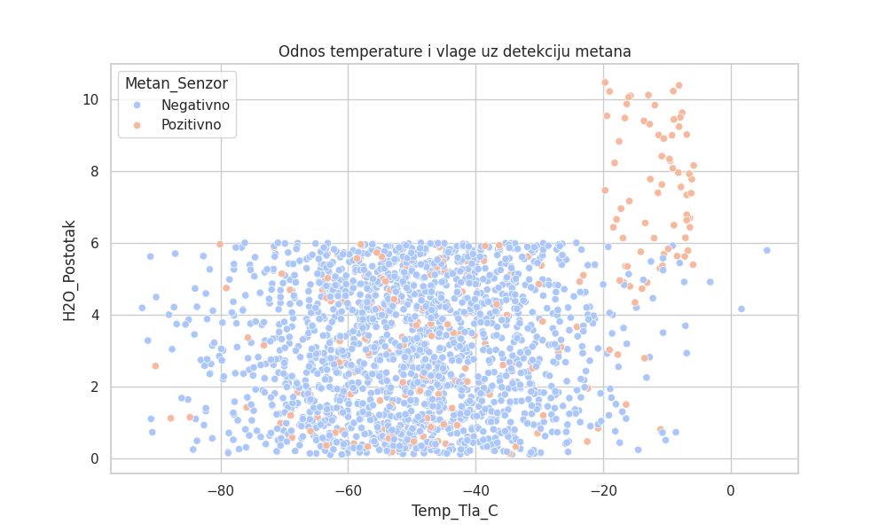
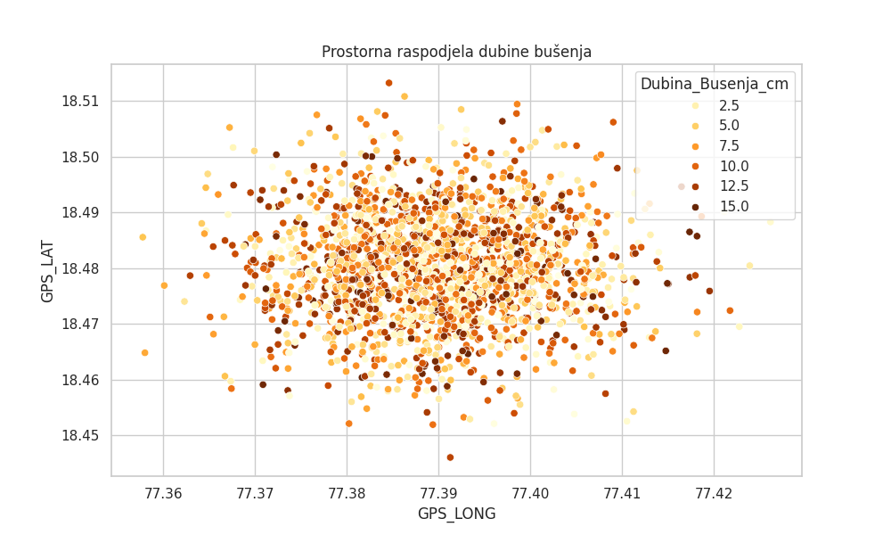
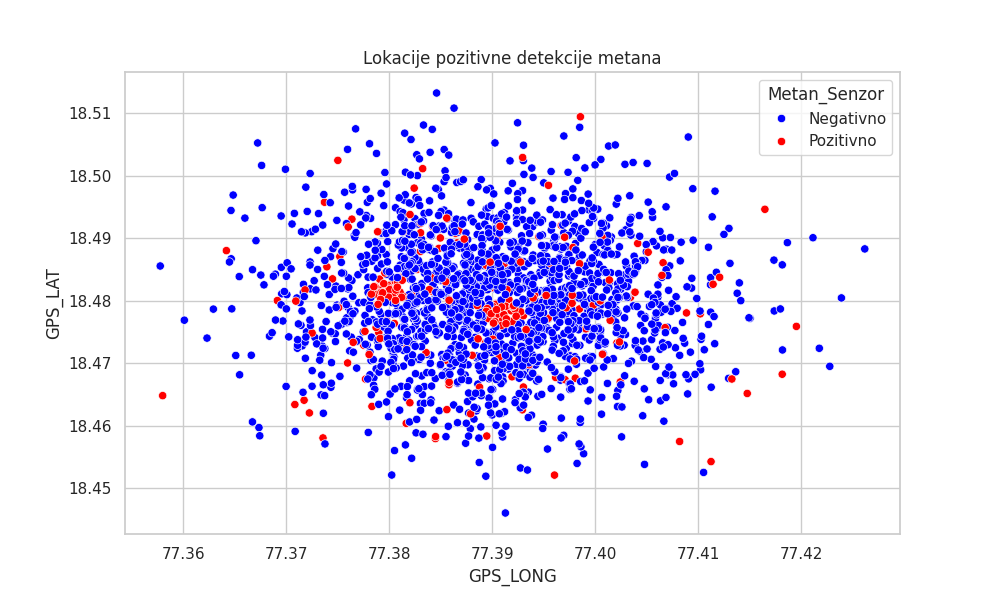
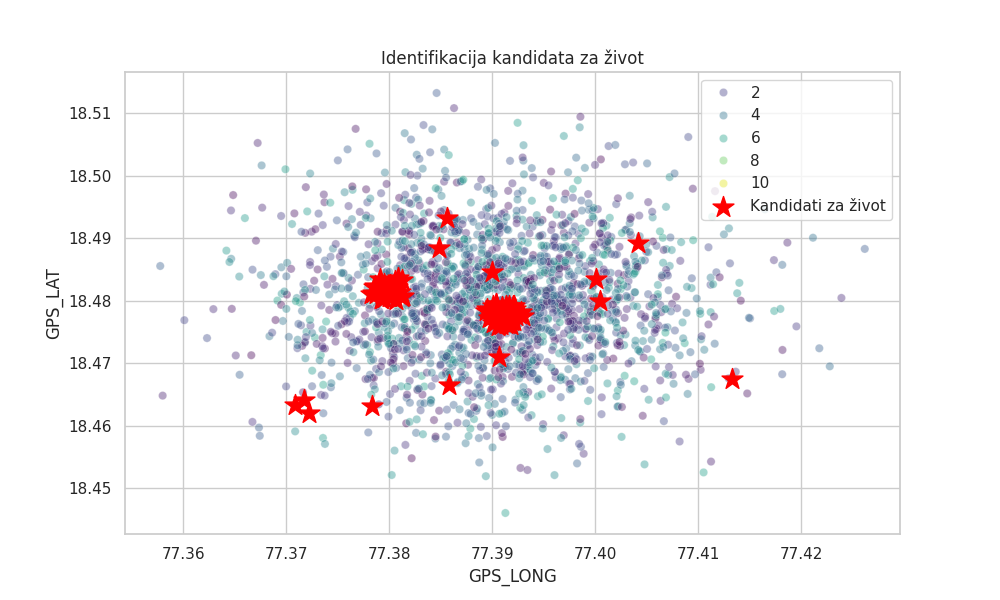
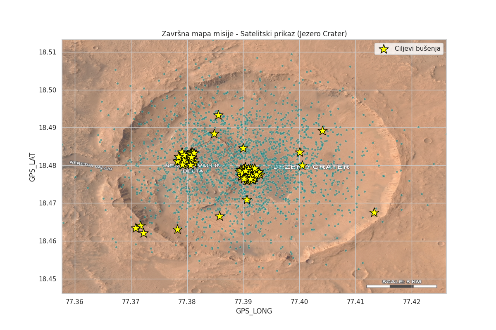

# Misija Nexus: Analitički izvještaj
**Autor:** Ivan Jurcan
**Projekt:** Istraživanje kratera Jezero

## 1. Sažetak
Ovaj projekt obuhvaća obradu senzorskih podataka prikupljenih s površine Marsa, identifikaciju lokacija s visokim potencijalom za život te generiranje strukturiranog JSON naloga za rover.

## 2. Obrada podataka
Podaci su učitani iz dva izvora (lokacije i uzorci) te spojeni u jedinstvenu bazu. Provedeno je strogo filtriranje anomalija (npr. pH vrijednosti izvan 0-14, temperature iznad 100°C) kako bi se osigurala točnost analize.
Kandidati za život definirani su kao lokacije s istovremenom detekcijom metana i prisutnošću organskih molekula.

## 3. Rezultati i interpretacija vizualizacija
U sklopu analize generirano je 5 ključnih vizualizacija:

### A. Odnos temperature i vlage

*Interpretacija: Vidljivo je da se pozitivne detekcije metana grupiraju u specifičnim temperaturnim rasponima...*

### B. Prostorna raspodjela dubine bušenja

*Interpretacija: Ova vizualizacija koristi gradaciju boja (YlOrBr) kako bi prikazala potrebnu dubinu sondiranja na različitim GPS koordinatama. Tamnija područja ukazuju na lokacije gdje je, prema inicijalnim očitanjima, potrebno dublje bušenje (do 15 cm) kako bi se dosegli relevantni slojevi tla.*

### C. Lokacije pozitivne detekcije metana

*Interpretacija: Graf jasno razgraničava negativna (plava) i pozitivna (crvena) očitanja metana. Grupiranje crvenih točaka u središnjem dijelu istraživanog područja poslužilo je kao prvi eliminacijski faktor za definiranje prioriteta misije.*

### D. Identifikacija kandidata za život

*Interpretacija: Analitička karta koja kombinira podatke o metanu i organskim molekulama. Crvene zvjezdice predstavljaju "Kandidate za život" – točke koje su prošle sve filtre i postale dio automatiziranog JSON naloga za kretanje rovera*

### E. Satelitska mapa misije (Jezero Crater)

*Interpretacija: Korištenjem 'extent' parametra, analitički rezultati su precizno preklopljeni sa satelitskom snimkom. Žute zvjezdice označavaju ciljeve za iduću fazu bušenja.*

## 4. Inženjerski dnevnik
Tijekom razvoja projekta riješeni su sljedeći tehnički izazovi:
1. **Problem s učitavanjem:** CSV datoteke su koristile ';' kao separator i ',' za decimale. Riješeno parametrom `sep=';'` i `decimal=','`.
2. **Greška pri izradi mape:** Python nije mogao pronaći satelitsku sliku zbog krivog naziva (`jezero_krater.jpg`). Ispravljeno korištenjem punog naziva `jezero_crater_satellite_map.jpg`.
3. **Poravnanje koordinata:** Inicijalno točke nisu odgovarale mapi. Problem je riješen dinamičkim izračunom `extent` parametra na temelju min/max GPS koordinata iz podataka.

## 5. Komunikacijski protokol
Finalni nalog je generiran u JSON formatu i sadrži tri akcije za svaku metu: Navigacija, Sondiranje i Slanje podataka.
